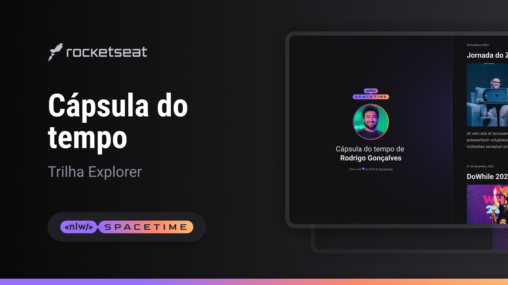

## 🖥️ projeto 
esse é um projeto Web responsivo de uma cápsula do tempo para exibir memórias em uma linha do tempo

## 🚀 Tecnologias
esse projeto foi desenvolvido durante o NLW Rocketseat com as seguintes  tecnologias:

- HTML
- CSS
- Git e Github

## 🏷️ Layout
Você pode visualizar o layoout do projeto através 
[desse link](https://www.figma.com/file/HFvEg5Qh109iR9VwGHkG7b/C%C3%A1psula-do-tempo-%E2%80%A2-Trilha-Explorer-(Community)?type=design&node-id=306-3&t=Cf68QmGGG7am1r6q-0).
É necessário ter uma conta no [Figma](https://www.figma.com/login)